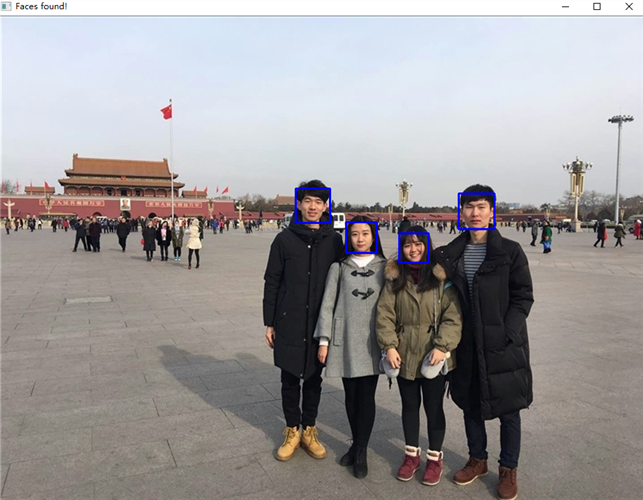
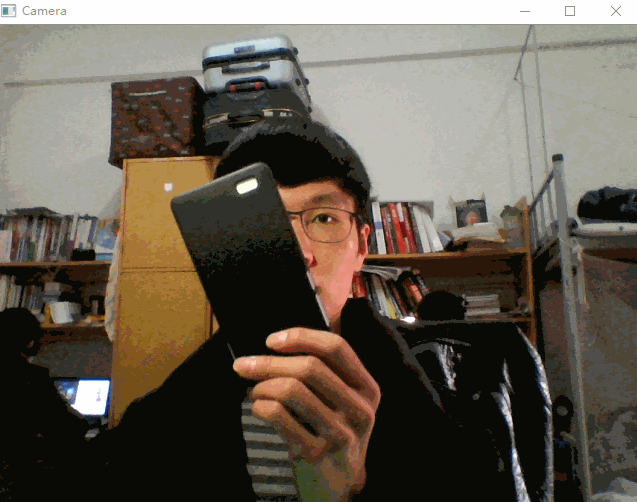

# FaceDetect

This repository contains several independent Python applications for face detect, as for image, video and camera. By using OpenCV-Python, we could conveniently construct face detect applications.

## How to run

Firstly, clone this repository on your disk. You could open the command prompt where you want to put it down. Then type as follows:

```
git clone https://github.com/ShawnyXiao/FaceDetect.git
```

### 1. Detect faces on an image

#### i. On a given image

In command prompt, type as follows, if you want to detect faces on the given image:

```
cd FaceDetectOnImage
python face_detect.py ../resources/image.jpg
```

Then we could get a processed image:



#### ii. On your own image

If you want to detect faces on your own image, you could type:

```
cd FaceDetectOnImage
python face_detect.py xxx
```

In above codes, "xxx" is the location of your own image.

### 2. Detect faces on a video

...

### 3. Detect faces on a camera

In command prompt, type as follows, if you want to detect faces on a camera:

```
cd FaceDetectOnCamera
python face_detect.py
```

While the camera is being opened, your face will be framed by a rectangle. If you want to exit, press the key ESC. The created window will be similar to this:



## References

- [Face Recognition with Python, in under 25 lines of code - Real Python](https://realpython.com/blog/python/face-recognition-with-python/)
- [Face detection in Python using a webcam - Real Python](https://realpython.com/blog/python/face-detection-in-python-using-a-webcam/)
- [25行Python代码完成人脸识别](https://python.freelycode.com/contribution/detail/36)
- [Face Detection using Haar Cascades &mdash; OpenCV-Python Tutorials 1 documentation](https://opencv-python-tutroals.readthedocs.io/en/latest/py_tutorials/py_objdetect/py_face_detection/py_face_detection.html#face-detection)
- [Python-OpenCV人脸检测(代码) - wepon的专栏 - 博客频道 - CSDN.NET](http://blog.csdn.net/u012162613/article/details/43523507)
- [Overview &mdash; Python 2.7.13 documentation](https://docs.python.org/2/index.html)
- [Python 2.7教程 - 廖雪峰的官方网站](http://www.liaoxuefeng.com/wiki/001374738125095c955c1e6d8bb493182103fac9270762a000)
- [Face detection in Python using a webcam - Real Python](https://realpython.com/blog/python/face-detection-in-python-using-a-webcam/)
- [Getting Started with Videos &mdash; OpenCV-Python Tutorials 1 documentation](http://opencv-python-tutroals.readthedocs.io/en/latest/py_tutorials/py_gui/py_video_display/py_video_display.html)
- [Reading and Writing Images and Video &mdash; OpenCV 2.4.13.2 documentation](http://docs.opencv.org/2.4/modules/highgui/doc/reading_and_writing_images_and_video.html#videocapture)
- [User Interface &mdash; OpenCV 2.4.13.2 documentation](http://docs.opencv.org/2.4/modules/highgui/doc/user_interface.html#waitkey)